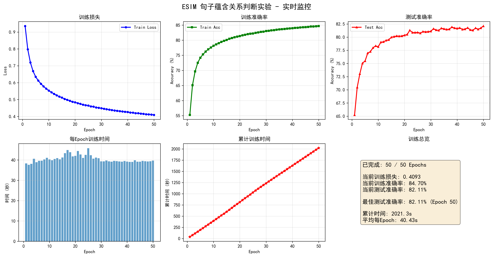

# Task3 实验报告：基于ESIM模型的自然语言推理

## 一、任务描述

自然语言推理（Natural Language Inference, NLI）也称为文本蕴含识别（Recognizing Textual Entailment, RTE），给定一个前提句（Premise）和一个假设句（Hypothesis），判断两者之间的语义关系。本实验使用 SNLI（Stanford Natural Language Inference）数据集，包含三种关系标签：

| 标签 | 含义 | 示例 |
|------|------|------|
| Entailment | 前提蕴含假设 | P: "一个人在骑马" → H: "一个人在户外" |
| Contradiction | 前提与假设矛盾 | P: "一个人在骑马" → H: "一个人在睡觉" |
| Neutral | 前提与假设无关 | P: "一个人在骑马" → H: "一个人在比赛" |

本实验采用 ESIM（Enhanced Sequential Inference Model）模型完成该任务。

---

## 二、模型原理

ESIM 由四个核心模块顺序组成：**输入编码 → 局部推理 → 推理组合 → 预测**。

### 2.1 输入编码（Input Encoding）

使用预训练的 GloVe 词向量作为输入，经过双向 LSTM 对前提和假设分别进行上下文编码：

$$
\bar{a}_i = \text{BiLSTM}(a, i), \quad i = 1, \dots, l_a
$$

$$
\bar{b}_j = \text{BiLSTM}(b, j), \quad j = 1, \dots, l_b
$$

其中 $a = (a_1, \dots, a_{l_a})$ 为前提的词嵌入序列，$b = (b_1, \dots, b_{l_b})$ 为假设的词嵌入序列。BiLSTM 的输出为前向和后向隐藏状态的拼接：

$$
\bar{a}_i = [\overrightarrow{h}_i^a ; \overleftarrow{h}_i^a] \in \mathbb{R}^{2d}
$$

### 2.2 局部推理建模（Local Inference Modeling）

通过注意力机制捕捉前提和假设之间的词级对齐关系。

**Step 1: 计算注意力权重矩阵**

$$
e_{ij} = \bar{a}_i^\top \bar{b}_j
$$

**Step 2: 软对齐（Soft Alignment）**

$$
\tilde{a}_i = \sum_{j=1}^{l_b} \frac{\exp(e_{ij})}{\sum_{k=1}^{l_b} \exp(e_{ik})} \bar{b}_j
$$

$$
\tilde{b}_j = \sum_{i=1}^{l_a} \frac{\exp(e_{ij})}{\sum_{k=1}^{l_a} \exp(e_{kj})} \bar{a}_i
$$

$\tilde{a}_i$ 是假设中与前提第 $i$ 个词最相关的加权表示，$\tilde{b}_j$ 同理。

**Step 3: 增强特征拼接**

为了捕捉对齐前后的差异，对原始编码和对齐结果进行差、积运算后拼接：

$$
m_a^i = [\bar{a}_i;\; \tilde{a}_i;\; \bar{a}_i - \tilde{a}_i;\; \bar{a}_i \odot \tilde{a}_i]
$$

$$
m_b^j = [\bar{b}_j;\; \tilde{b}_j;\; \bar{b}_j - \tilde{b}_j;\; \bar{b}_j \odot \tilde{b}_j]
$$

其中 $\odot$ 为逐元素乘法，$[\,;\,]$ 为向量拼接。每个 $m_a^i, m_b^j \in \mathbb{R}^{8d}$。

### 2.3 推理组合（Inference Composition）

先通过线性层将 $8d$ 维降至 $d'$ 维，再通过另一个 BiLSTM 捕捉序列级推理：

$$
v_a^i = \text{BiLSTM}(F(m_a), i)
$$

$$
v_b^j = \text{BiLSTM}(F(m_b), j)
$$

其中 $F(\cdot)$ 为线性变换 + Dropout。

对组合结果分别做平均池化和最大池化：

$$
v_{a,\text{avg}} = \frac{1}{l_a}\sum_{i=1}^{l_a} v_a^i, \quad v_{a,\text{max}} = \max_{i=1}^{l_a} v_a^i
$$

$$
v_{b,\text{avg}} = \frac{1}{l_b}\sum_{j=1}^{l_b} v_b^j, \quad v_{b,\text{max}} = \max_{j=1}^{l_b} v_b^j
$$

最终向量：

$$
v = [v_{a,\text{avg}};\; v_{a,\text{max}};\; v_{b,\text{avg}};\; v_{b,\text{max}}] \in \mathbb{R}^{8d}
$$

### 2.4 预测层（Prediction）

通过 MLP 分类器输出预测：

$$
\hat{y} = \text{softmax}(W_2 \cdot \tanh(W_1 v + b_1) + b_2)
$$

其中 $W_1 \in \mathbb{R}^{d \times 8d}$，$W_2 \in \mathbb{R}^{C \times d}$，$C = 4$ 为类别数（含"-"标签）。

---

## 三、损失函数与梯度推导

### 3.1 损失函数

采用交叉熵损失：

$$
\mathcal{L} = -\frac{1}{N}\sum_{n=1}^{N}\sum_{c=1}^{C} y_c^{(n)} \log \hat{y}_c^{(n)}
$$

其中 $y_c^{(n)}$ 为 one-hot 真实标签，$\hat{y}_c^{(n)}$ 为 softmax 输出。

### 3.2 Softmax + 交叉熵梯度

设 softmax 输入为 $z = (z_1, \dots, z_C)$，则：

$$
\hat{y}_c = \frac{e^{z_c}}{\sum_{k=1}^{C} e^{z_k}}
$$

对于真实类别 $t$，交叉熵损失对 $z_c$ 的梯度为：

$$
\frac{\partial \mathcal{L}}{\partial z_c} = \hat{y}_c - y_c = \hat{y}_c - \mathbb{1}[c = t]
$$

**推导过程**：

当 $c = t$ 时：

$$
\frac{\partial \mathcal{L}}{\partial z_t} = -\frac{\partial}{\partial z_t}\log\hat{y}_t = -\frac{1}{\hat{y}_t}\cdot\hat{y}_t(1-\hat{y}_t) = \hat{y}_t - 1
$$

当 $c \neq t$ 时：

$$
\frac{\partial \mathcal{L}}{\partial z_c} = -\frac{\partial}{\partial z_c}\log\hat{y}_t = -\frac{1}{\hat{y}_t}\cdot(-\hat{y}_t\hat{y}_c) = \hat{y}_c
$$

合并：$\frac{\partial \mathcal{L}}{\partial z_c} = \hat{y}_c - y_c$。

### 3.3 MLP 层梯度

设 $h = \tanh(W_1 v + b_1)$，$z = W_2 h + b_2$。

**输出层权重**：

$$
\frac{\partial \mathcal{L}}{\partial W_2} = (\hat{y} - y) h^\top
$$

$$
\frac{\partial \mathcal{L}}{\partial b_2} = \hat{y} - y
$$

**隐藏层反向传播**：

$$
\delta_h = W_2^\top (\hat{y} - y) \odot (1 - h^2)
$$

其中 $(1 - h^2)$ 是 $\tanh$ 的导数。

$$
\frac{\partial \mathcal{L}}{\partial W_1} = \delta_h \cdot v^\top
$$

$$
\frac{\partial \mathcal{L}}{\partial b_1} = \delta_h
$$

### 3.4 LSTM 梯度（BPTT）

BiLSTM 通过时间反向传播（Backpropagation Through Time）计算梯度。对于前向 LSTM 的单元，设：

$$
f_t = \sigma(W_f [h_{t-1}, x_t] + b_f) \quad \text{（遗忘门）}
$$

$$
i_t = \sigma(W_i [h_{t-1}, x_t] + b_i) \quad \text{（输入门）}
$$

$$
\tilde{c}_t = \tanh(W_c [h_{t-1}, x_t] + b_c) \quad \text{（候选记忆）}
$$

$$
c_t = f_t \odot c_{t-1} + i_t \odot \tilde{c}_t \quad \text{（细胞状态更新）}
$$

$$
o_t = \sigma(W_o [h_{t-1}, x_t] + b_o) \quad \text{（输出门）}
$$

$$
h_t = o_t \odot \tanh(c_t) \quad \text{（隐藏状态）}
$$

梯度沿两条路径回传：

1. **沿隐藏状态** $h_t \to h_{t-1}$：经过各门控单元
2. **沿细胞状态** $c_t \to c_{t-1}$：由 $c_t = f_t \odot c_{t-1} + \dots$ 得

$$
\frac{\partial c_t}{\partial c_{t-1}} = f_t
$$

遗忘门 $f_t$ 的值控制了梯度沿细胞状态的流动，这是 LSTM 缓解梯度消失的核心机制。

### 3.5 注意力层梯度

注意力权重 $\alpha_{ij} = \text{softmax}_j(e_{ij})$，其中 $e_{ij} = \bar{a}_i^\top \bar{b}_j$。

对 $\bar{a}_i$ 的梯度：

$$
\frac{\partial \mathcal{L}}{\partial \bar{a}_i} = \sum_j \frac{\partial \mathcal{L}}{\partial e_{ij}} \bar{b}_j + \frac{\partial \mathcal{L}}{\partial m_a^i} \text{ 的对应分量}
$$

增强特征中差和积的梯度：

$$
\frac{\partial}{\partial \bar{a}_i}(\bar{a}_i - \tilde{a}_i) = I - \frac{\partial \tilde{a}_i}{\partial \bar{a}_i}
$$

$$
\frac{\partial}{\partial \bar{a}_i}(\bar{a}_i \odot \tilde{a}_i) = \text{diag}(\tilde{a}_i) + \text{diag}(\bar{a}_i)\frac{\partial \tilde{a}_i}{\partial \bar{a}_i}
$$

这些梯度通过 PyTorch 的自动微分机制自动计算。

---

## 四、实验设置

| 参数 | 值 |
|------|------|
| 数据集 | SNLI (Stanford NLI) |
| 训练样本数 | ~523,000 |
| 测试样本数 | ~27,000 |
| 词嵌入 | GloVe 6B 50d |
| 嵌入维度 | 50 |
| LSTM 隐藏层维度 | 64 |
| BiLSTM 输出维度 | 128 (64×2) |
| 分类类别数 | 4 (entailment, contradiction, neutral, -) |
| 优化器 | Adam (lr=0.001) |
| Batch Size | 500 |
| Dropout | 0.5 |
| Epochs | 50 |

---

## 五、实验结果

### 5.1 训练曲线

### 5.2 关键数据

| 指标 | 值 |
|------|------|
| 最终训练准确率 | 84.70% |
| 最终测试准确率 | 82.11% |
| 最佳测试准确率 | 82.11% (Epoch 50) |
| 总训练时间 | 2053.32 秒 (≈34.2 分钟) |
| 平均每 Epoch 时间 | 41.07 秒 |

### 5.3 训练过程分析

| 阶段 | Epoch | Train Loss | Train Acc | Test Acc | 特征 |
|------|-------|-----------|-----------|----------|------|
| 快速收敛期 | 1-10 | 0.94→0.55 | 55.3%→78.2% | 65.2%→78.2% | 损失快速下降，准确率大幅提升 |
| 稳定提升期 | 11-30 | 0.54→0.45 | 78.6%→83.0% | 79.0%→81.1% | 训练测试同步缓慢提升 |
| 收敛平台期 | 31-50 | 0.45→0.41 | 83.1%→84.7% | 81.6%→82.1% | 训练仍有提升，测试趋于平稳 |

---

## 六、结论

### 6.1 模型性能

1. **ESIM 模型在 SNLI 数据集上取得了 82.11% 的测试准确率**，验证了基于注意力机制的句子交互模型在自然语言推理任务上的有效性。

2. **注意力机制的关键作用**：局部推理模块通过软对齐建立了词级的跨句子关联，配合差值和逐元素乘法的增强特征，使模型能够有效捕捉蕴含、矛盾、中立三种语义关系的细微差别。

3. **双向 LSTM 的双重使用**：输入编码阶段利用 BiLSTM 获取上下文相关的词表示，推理组合阶段再次利用 BiLSTM 捕捉对齐后的序列级推理模式，两次编码各司其职。

### 6.2 训练特性

1. **收敛速度快**：前 10 个 Epoch 即从 55% 提升至 78%，说明 ESIM 的架构设计对 NLI 任务具有较强的归纳偏置。

2. **泛化能力良好**：训练集（84.7%）与测试集（82.1%）准确率差距约 2.6%，过拟合程度可控，Dropout=0.5 起到了有效的正则化效果。

3. **训练效率稳定**：每个 Epoch 耗时约 39-45 秒，波动较小，说明 SNLI 数据分布均匀，模型计算量一致。

### 6.3 可改进方向

1. **提升嵌入维度**：当前使用 GloVe 50d，换用 300d 词向量可提供更丰富的语义信息。
2. **增大隐藏层维度**：当前 `len_hidden=64`，ESIM 原论文使用 300 维隐藏层，增大维度有助于提升性能。
3. **引入字符级编码**：对未登录词（OOV）使用字符级 CNN 或 LSTM 编码，减少零向量带来的信息损失。
4. **学习率调度**：引入 ReduceLROnPlateau 或 Warmup 策略，帮助模型在后期跳出局部最优。

---

