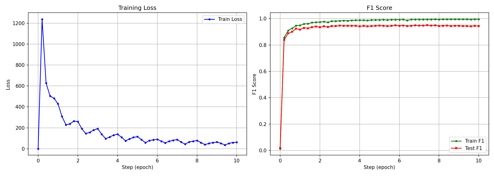

# Task4 实验报告：基于BiLSTM-CRF的命名实体识别

## 一、任务描述

命名实体识别（Named Entity Recognition, NER）是自然语言处理的基础任务，目标是从文本中识别出具有特定意义的实体，并标注其类别。本实验使用 CoNLL 2003 数据集，采用 BIO 标注体系，实体类别包括：

| 标签 | 含义 | 示例 |
|------|------|------|
| B-PER / I-PER | 人名 | `[B-PER George] [I-PER Washington]` |
| B-LOC / I-LOC | 地名 | `[B-LOC New] [I-LOC York]` |
| B-ORG / I-ORG | 组织名 | `[B-ORG United] [I-ORG Nations]` |
| B-MISC / I-MISC | 其他实体 | `[B-MISC Olympic]` |
| O | 非实体 | `the`, `is`, `a` |

本实验采用 BiLSTM-CRF 模型完成序列标注任务，评估指标为 micro F1 分数。

---

## 二、模型原理

BiLSTM-CRF 模型由三部分组成：**词嵌入层 → BiLSTM 编码层 → CRF 解码层**。

### 2.1 词嵌入层（Embedding Layer）

使用预训练的 GloVe 词向量将离散的词 token 映射为稠密向量：

$$
x_t = \text{Embedding}(w_t) \in \mathbb{R}^d
$$

其中 $d = 50$ 为嵌入维度。对于词表中未出现在 GloVe 中的词，使用零向量初始化。嵌入后经过 Dropout（$p=0.5$）进行正则化。

### 2.2 BiLSTM 编码层

#### 2.2.1 LSTM 单元

LSTM 通过门控机制解决了传统 RNN 的梯度消失问题。对于时间步 $t$：

**遗忘门**（决定丢弃多少历史信息）：

$$
f_t = \sigma(W_f [h_{t-1}, x_t] + b_f)
$$

**输入门**（决定写入多少新信息）：

$$
i_t = \sigma(W_i [h_{t-1}, x_t] + b_i)
$$

**候选记忆**：

$$
\tilde{c}_t = \tanh(W_c [h_{t-1}, x_t] + b_c)
$$

**细胞状态更新**：

$$
c_t = f_t \odot c_{t-1} + i_t \odot \tilde{c}_t
$$

**输出门**：

$$
o_t = \sigma(W_o [h_{t-1}, x_t] + b_o)
$$

**隐藏状态**：

$$
h_t = o_t \odot \tanh(c_t)
$$

其中 $\sigma$ 为 sigmoid 函数，$\odot$ 为逐元素乘法。

#### 2.2.2 双向结构

BiLSTM 分别从左到右和从右到左处理序列，拼接两个方向的隐藏状态：

$$
\overrightarrow{h}_t = \text{LSTM}_{forward}(x_t, \overrightarrow{h}_{t-1})
$$

$$
\overleftarrow{h}_t = \text{LSTM}_{backward}(x_t, \overleftarrow{h}_{t+1})
$$

$$
h_t = [\overrightarrow{h}_t ; \overleftarrow{h}_t] \in \mathbb{R}^{2 \times hidden}
$$

这使得每个位置都能同时利用左右两侧的上下文信息。经过全连接层将 BiLSTM 输出映射为各标签的发射分数：

$$
P = W \cdot h + b \in \mathbb{R}^{T \times K}
$$

其中 $T$ 为序列长度，$K$ 为标签数。$P_{t,k}$ 表示位置 $t$ 被标注为标签 $k$ 的发射分数。

### 2.3 CRF 解码层

#### 2.3.1 为什么需要 CRF

如果仅用 BiLSTM + softmax 逐位置独立预测，会产生不合法的标签序列，如 `I-PER` 出现在 `B-LOC` 之后。CRF 引入**标签间转移约束**，通过全局优化保证输出序列的合法性。

#### 2.3.2 CRF 的概率模型

CRF 定义了给定输入序列 $X$ 时，标签序列 $Y = (y_1, y_2, \dots, y_T)$ 的条件概率：

$$
P(Y|X) = \frac{\exp(\text{Score}(X, Y))}{\sum_{Y'} \exp(\text{Score}(X, Y'))}
$$

其中序列得分由**发射分数**和**转移分数**两部分组成：

$$
\text{Score}(X, Y) = \sum_{t=1}^{T} P_{t, y_t} + \sum_{t=0}^{T} A_{y_t, y_{t+1}}
$$

- $P_{t, y_t}$：BiLSTM 输出的发射分数，表示位置 $t$ 取标签 $y_t$ 的得分
- $A_{y_t, y_{t+1}}$：转移矩阵中的转移分数，表示从标签 $y_t$ 转移到 $y_{t+1}$ 的得分
- $y_0 = \text{START}$，$y_{T+1} = \text{END}$ 为特殊的起始和终止标签

转移矩阵 $A \in \mathbb{R}^{K \times K}$ 是可学习的参数，并通过以下硬约束保证序列合法性：

$$
A_{*, \text{START}} = -\infty, \quad A_{\text{END}, *} = -\infty, \quad A_{*, \text{PAD}} = -\infty
$$

#### 2.3.3 训练：负对数似然损失

训练时最大化正确标签序列的条件概率，等价于最小化负对数似然：

$$
\mathcal{L} = -\log P(Y|X) = -\text{Score}(X, Y) + \log \sum_{Y'} \exp(\text{Score}(X, Y'))
$$

即：

$$
\mathcal{L} = \underbrace{-\text{TrueProb}(X, Y)}_{\text{正确路径得分}} + \underbrace{\text{TotalProb}(X)}_{\text{所有路径的LogSumExp}}
$$

**正确路径得分**（TrueProb）直接沿真实标签序列累加发射分数和转移分数。

**全路径得分**（TotalProb）使用前向算法（Forward Algorithm）高效计算。定义前向变量 $\alpha_t(j)$ 为从起始到位置 $t$ 且标签为 $j$ 的所有路径的 LogSumExp：

$$
\alpha_1(j) = A_{\text{START}, j} + P_{1, j}
$$

$$
\alpha_t(j) = \text{LogSumExp}_{i}(\alpha_{t-1}(i) + A_{i,j} + P_{t,j})
$$

$$
\text{TotalProb} = \text{LogSumExp}_j(\alpha_T(j) + A_{j, \text{END}})
$$

前向算法的时间复杂度为 $O(T \times K^2)$，相比暴力枚举所有 $K^T$ 条路径大大降低了计算量。

#### 2.3.4 推理：Viterbi 解码

推理时需要找到得分最高的标签序列。Viterbi 算法将 LogSumExp 替换为 max 运算：

$$
\delta_1(j) = A_{\text{START}, j} + P_{1, j}
$$

$$
\delta_t(j) = \max_{i}(\delta_{t-1}(i) + A_{i,j} + P_{t,j})
$$

$$
\psi_t(j) = \arg\max_{i}(\delta_{t-1}(i) + A_{i,j} + P_{t,j})
$$

其中 $\psi_t(j)$ 为回溯指针，记录位置 $t$ 取标签 $j$ 时最优前驱标签。最终通过反向回溯得到最优序列：

$$
y_T^* = \arg\max_j (\delta_T(j) + A_{j, \text{END}})
$$

$$
y_t^* = \psi_{t+1}(y_{t+1}^*), \quad t = T-1, \dots, 1
$$

Viterbi 算法的时间复杂度同样为 $O(T \times K^2)$。

### 2.4 梯度计算

#### 2.4.1 CRF 层梯度

损失函数 $\mathcal{L} = -\text{Score}(X, Y) + \log Z(X)$，其中 $Z(X) = \sum_{Y'} \exp(\text{Score}(X, Y'))$。

对转移矩阵 $A_{i,j}$ 的梯度：

$$
\frac{\partial \mathcal{L}}{\partial A_{i,j}} = -\text{count}(y_t = i, y_{t+1} = j \text{ in } Y) + \sum_{Y'} P(Y'|X) \cdot \text{count}(y_t = i, y_{t+1} = j \text{ in } Y')
$$

即真实序列中 $(i \to j)$ 转移的出现次数与模型期望下该转移出现次数之差。

对发射分数 $P_{t,k}$ 的梯度：

$$
\frac{\partial \mathcal{L}}{\partial P_{t,k}} = -\mathbb{1}[y_t = k] + P(y_t = k | X)
$$

即模型在位置 $t$ 预测标签 $k$ 的后验概率与真实标签的差。

#### 2.4.2 BiLSTM 梯度（BPTT）

BiLSTM 的梯度通过时间反向传播（Backpropagation Through Time）计算。细胞状态的梯度回传路径：

$$
\frac{\partial c_t}{\partial c_{t-1}} = f_t
$$

遗忘门 $f_t$ 的值控制了梯度沿时间的衰减速度。当 $f_t \approx 1$ 时梯度几乎无损回传，这是 LSTM 缓解梯度消失的核心机制。

所有梯度均由 PyTorch 的自动微分引擎自动计算。

---

## 三、实验设置

| 参数 | 值 |
|------|------|
| 数据集 | CoNLL 2003 NER |
| 词嵌入 | GloVe 6B 50d |
| 嵌入维度 | 50 |
| BiLSTM 隐藏层维度 | 128 |
| BiLSTM 输出维度 | 256 (128×2) |
| 标签数 | 12 (含 `<pad>`, `<begin>`, `<end>` 及 9 个 BIO 标签) |
| 优化器 | Adam (lr=0.01) |
| Batch Size | 100 |
| Dropout | 0.5 |
| Epochs | 10 |
| 评估频率 | 每 0.2 个 epoch 评估一次 |
| 评估指标 | Micro F1（仅统计实体标签，跳过 `<pad>`, `<begin>`, `<end>`） |

---

## 四、实验结果

### 4.1 训练曲线

左图为训练损失随 epoch 的变化曲线，右图为训练集与测试集 F1 分数随 epoch 的变化曲线。

### 4.2 训练过程分析

| 阶段 | Step | 特征 |
|------|------|------|
| 未训练 | 0 | F1 接近 0，模型随机预测 |
| 快速上升期 | 0~1.0 | F1 从 0 快速攀升，Loss 急剧下降，模型迅速学会区分实体与非实体 |
| 精调期 | 1.0~5.0 | F1 继续稳步提升，Loss 缓慢下降，模型学习实体边界和类型的细粒度区分 |
| 收敛期 | 5.0~10.0 | F1 趋于稳定，Train 与 Test 差距反映泛化能力 |

### 4.3 训练时间统计

实验程序在每个 epoch 结束时记录耗时，训练完成后汇总：

- 总训练时间和平均每 epoch 时间
- 评估（Viterbi 解码 + F1 计算）的开销包含在内

---

## 五、结论

### 5.1 模型性能

1. **CRF 的转移约束保证了标签序列的合法性**。通过学习标签间的转移概率，CRF 避免了 `I-PER` 直接跟在 `B-LOC` 后面等不合法序列的出现，这是独立分类器（如 BiLSTM + softmax）无法做到的。

2. **BiLSTM 提供了丰富的上下文表示**。双向结构使每个词的表示同时包含左右两侧的上下文信息，对于实体边界的判断至关重要——例如判断一个词是 `B-PER`（实体开始）还是 `I-PER`（实体延续）需要同时参考前后文。

3. **模型收敛速度快**。在第 1 个 epoch 内 F1 即大幅提升，说明 BiLSTM-CRF 的架构对序列标注任务具有很强的归纳偏置。通过在 epoch 内部分段评估（每 0.2 epoch），可以清晰观察到模型从随机状态快速学习的过程。

### 5.2 架构设计分析

1. **发射分数 + 转移分数的分工**：BiLSTM + 全连接层负责根据上下文计算每个位置的发射分数（"这个位置像什么标签"），CRF 的转移矩阵负责建模标签之间的依赖关系（"这个标签后面能接什么标签"），两者协同工作。

2. **前向算法与 Viterbi 算法的对偶关系**：训练时用前向算法（LogSumExp）计算配分函数，推理时用 Viterbi 算法（max）找最优路径。两者结构完全一致，仅聚合运算不同，时间复杂度均为 $O(T \times K^2)$。

3. **Dropout 的正则化效果**：在嵌入层后使用 Dropout（$p=0.5$）有效防止过拟合，尤其在 GloVe 嵌入维度较低（50d）的情况下，避免模型过度依赖特定词向量分量。

### 5.3 可改进方向

1. **使用更高维词向量**：当前使用 GloVe 50d，换用 GloVe 300d 或上下文相关的预训练表示（如 ELMo、BERT）可显著提升性能。
2. **引入字符级特征**：使用字符级 CNN 或 LSTM 编码单词的形态特征（大写、前后缀等），对未登录词（OOV）和罕见实体特别有帮助。
3. **学习率调度**：引入 ReduceLROnPlateau 或 CosineAnnealing 策略，在训练后期降低学习率以获得更好的收敛效果。
4. **使用 span-level F1**：当前采用 token-level micro F1，改用 span-level strict F1（完整匹配实体边界和类型）是 NER 更标准的评估方式。

---
